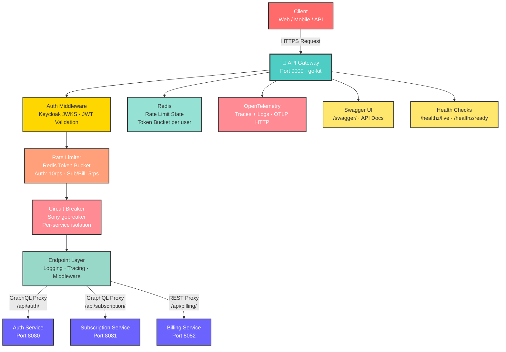

# API Gateway

A Go API gateway built with **go-kit** that serves as the single entry point for the SaaS platform. It handles JWT authentication via **Keycloak**, per-endpoint **Redis rate limiting**, **circuit breaking**, distributed tracing, and proxies requests to the auth, subscription, and billing microservices.

## Tags


## Architecture



## Tech Stack

| Concern | Technology |
|---|---|
| Language | Go 1.25 |
| Framework | go-kit |
| Auth | Keycloak (JWKS / JWT validation via `golang-jwt/jwt`) |
| Rate Limiting | Redis (`go-redis/v9`) — token bucket per endpoint |
| Circuit Breaker | Sony gobreaker |
| Observability | OpenTelemetry (traces + logs via OTLP HTTP) |
| API Docs | Swagger (swaggo/http-swagger) |
| Config | Viper |
| Graceful Shutdown | `errgroup` + OS signal handling |

## Features

- **JWT authentication** — validates Bearer tokens against Keycloak's JWKS endpoint; subscription and billing endpoints are protected, auth endpoints are public
- **Rate limiting** — Redis-backed token bucket per endpoint:
  - Auth: 10 req/token, burst 5
  - Subscription: 5 req/token, burst 3
  - Billing: 5 req/token, burst 3
- **Circuit breaker** — wraps each upstream service; configurable timeout, error threshold, and reset timeout
- **Dual transport** — GraphQL reverse proxy for auth/subscription, REST reverse proxy for billing
- **CORS** — configurable allowed origins
- **Swagger UI** — available at `/swagger/`
- **Health endpoints** — `/healthz/live` and `/healthz/ready`
- **Graceful shutdown** — 5-second drain on SIGTERM/SIGINT

## Project Structure

```
api-gateway/
├── main.go                      # Entry point, wiring
├── app.yaml                     # Configuration file
├── endpoint/
│   ├── auth.endpoint.go         # Auth endpoint factory
│   ├── subscription.endpoint.go # Subscription endpoint factory
│   ├── billing.endpoint.go      # Billing endpoint factory
│   ├── logging.endpoint.go      # Logging middleware
│   ├── ratelimit.endpoint.go    # Redis rate-limit middleware
│   └── tracing.endpoint.go      # OTel tracing middleware
├── interceptor/
│   ├── jwt.interceptor.go       # JWT validation middleware
│   └── keycloak.interceptor.go  # Keycloak JWKS middleware
├── service/
│   └── forward.service.go       # HTTP reverse proxy + circuit breaker
├── transport/
│   ├── graphql.transport.go     # GraphQL reverse proxy handler
│   ├── rest.transpost.go        # REST reverse proxy handler
│   └── cors.go                  # CORS middleware
├── circuit/
│   └── breaker.go               # gobreaker wrapper
├── throttling/
│   └── throttling.setup.go      # Redis rate limiter setup
├── logging/
│   ├── logging.init.go          # OTel logger init
│   ├── logging.bridge.go        # go-kit ↔ OTel bridge
│   └── logging.span.go          # Span logging helpers
├── tracing/
│   └── tracing.go               # OTel tracer init
├── utils/
│   ├── config.go                # Viper config loader
│   └── validator.go             # Input validation helpers
├── errors/
│   └── error.go                 # Shared error types
├── docs/                        # Swagger generated docs
├── integration/                 # Integration tests
├── Makefile
└── Dockerfile
```

## Getting Started

### Prerequisites

- Go 1.25+
- Redis
- Keycloak (or any OIDC provider with a JWKS endpoint)
- Running downstream services (auth, subscription, billing)

### Configuration

The gateway reads from `app.yaml` (or environment variable overrides via Viper):

```yaml
app:
  name: api-gateway
  env: dev
  port: 9000

services:
  auth:
    url: http://localhost:8080
  subscription:
    url: http://localhost:8081
  billing:
    url: http://localhost:8082

keycloak:
  jwksURL: http://localhost:8180/realms/saas/protocol/openid-connect/certs

redis:
  url: localhost:6379

cors:
  allowedOrigins:
    - http://localhost:3000
    - http://localhost:5173

circuitBreaker:
  timeoutMs: 5000
  errorThreshold: 50
  resetTimeoutMs: 10000
```

All values can be overridden with environment variables using the `GATEWAY_` prefix (e.g., `GATEWAY_APP_PORT=9000`).

### Build & Run

```bash
# Download dependencies
go mod download

# Run
go run main.go

# Build binary
go build -o api-gateway .

# Or use the Makefile
make run
make build
```

### Testing

```bash
# Unit tests
go test ./...

# Integration tests
go test ./integration/...

# With race detector
go test -race ./...
```

### Generate Swagger Docs

```bash
# Install swag CLI
go install github.com/swaggo/swag/cmd/swag@latest

# Generate
swag init
```

Swagger UI is served at `http://localhost:9000/swagger/`.

## Routing

| Path | Upstream | Auth Required | Transport |
|---|---|---|---|
| `/api/auth/*` | Auth Service | No | GraphQL proxy |
| `/api/subscription/*` | Subscription Service | Yes (JWT) | GraphQL proxy |
| `/api/billing/*` | Billing Service | Yes (JWT) | REST proxy |
| `/swagger/*` | — | No | Swagger UI |
| `/healthz/live` | — | No | 200 OK |
| `/healthz/ready` | — | No | 200 OK |

## Circuit Breaker

Each upstream service has its own `gobreaker.CircuitBreaker` instance. Configuration (from `app.yaml`):

- `timeoutMs` — request timeout before counting as failure
- `errorThreshold` — percentage of failures to trip the breaker
- `resetTimeoutMs` — time in open state before attempting half-open

When a circuit is open, the gateway returns `503 Service Unavailable` immediately without forwarding the request.

## Docker

```bash
docker build -t api-gateway .
docker run -p 9000:9000 \
  -e GATEWAY_KEYCLOAK_JWKSURL=http://keycloak:8080/realms/saas/protocol/openid-connect/certs \
  -e GATEWAY_REDIS_URL=redis:6379 \
  api-gateway
```

## CI/CD

GitHub Actions workflows in `.github/workflows/`:

- `api-gateway-ci.yml` — lint, test, build on push/PR
- `api-gateway-cd.yml` — build & push Docker image on merge to main
- `test.yml` — standalone test runner

## License

MIT
